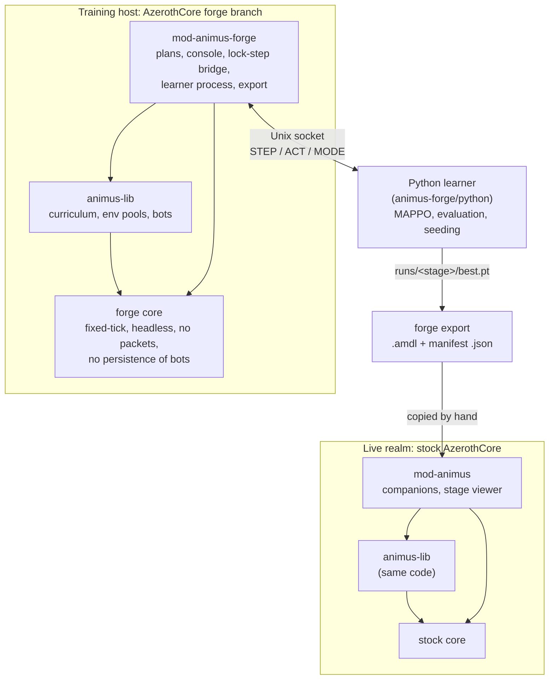

# 1. Overview

## The goal

Animus aims to fill every group role in World of Warcraft 3.3.5a with bots that play well enough for a single human to
run dungeons, group quests and PvP with them. The design document (`core/design-doc.md`) describes a hybrid:

- **In combat, a neural network decides**: when and where to move, which target to pick, which ability (and which
  rank) to use and when, and which trinkets and consumables to use.
- **Out of combat, scripts decide**: following the player, buffing, conjuring food, summoning, pathing. These tasks
  are well understood and don't need learning.

The networks are trained with **MAPPO** (multi-agent PPO with a centralised critic). Each agent observes only its own
situation and decides independently, like a human player. There is **one model per class** (`warrior`, `priest`,
...), ten in all, and each covers every role its class can play: one paladin network tanks, heals and deals
damage. All ten share one trunk during training, so what one class learns about moving, threat or interrupts
helps the others.

A model is told which role it is in and what talents it has, never which spec it is. The role is the contract it
is graded under -- a tank is paid for threat, a healer for healing -- and one network covering three roles has to
know which it is in. The spec is only a name for a talent build, and the build itself is already observed, rank
by rank; the character generator picks a spec that plays the role the episode asked for, and the model plays the
character it was handed. The (class, role) pair is still the unit everything is *measured* at: the difficulty
ladder, the sampling weights and the evaluation seed spread all key on it, so a paladin's healing is scored apart
from its tanking. Ten things do the playing; eighteen are watched.

Nothing controls a seat. Team stages add a **director** -- one agent a side that calls a target, a posture, a
rally point and whose turn the next interrupt is -- but what it emits is advice a seat reads and weighs, not a
lever: the `Order` block has thirteen observations and no actions. A seat under a director still chooses every
action it takes. See [4.12](04-curriculum.md#412-team-play-and-the-director).

Rewards are dense because a dungeon clear is too rare a signal to learn from. They pay for damage dealt, effective
healing, kills, interrupts, resurrections and protecting allies. They penalise damage taken, deaths and losing threat.
The curriculum starts with one-on-one fights and adds packs, sustained pulls, an owner to protect, a party and PvP.

## The four pieces



**The forge core** is AzerothCore with the parts a simulator doesn't need removed or replaced. The world advances in
fixed steps as fast as the CPU allows. Nothing is sent to clients because there are none. Bot characters are never
saved. Cooldowns, procs and respawns follow the simulated clock instead of the wall clock. See
[chapter 2](02-forge-core.md).

**animus-lib** holds everything about what the bots learn: stage definitions, the observation and action encoding
(blocks and layouts), the encounters the bots fight, rewards, character building (race, talents, gear, consumables),
env pools, the sessionless bot factory and the `.amdl` model reader. It uses only public core APIs, so it builds on both
the forge core and a stock core. For the few things only the forge core can do, it calls `CoreHooks`, which the forge
module fills in. See [chapter 3](03-animus-lib.md) and [chapter 4](04-curriculum.md).

**Animus Forge** (`mod-animus-forge`) runs training. It holds the plan of stages to train, the console commands, the
socket bridge to the learner, the learner child process, progress reports and model export. Its `python/` directory
is the learner: MAPPO networks and updates, rollouts, seeded evaluation, the convergence rule that ends a stage, seeding
from earlier stages, distillation and export. See [chapter 5](05-animus-forge.md).

**Animus** (`mod-animus`) runs trained models on an ordinary realm with real clients. Players summon class
companions into their party. Game masters can watch any curriculum stage play out in their own instance. It needs no
core changes. See [chapter 6](06-animus.md).

### Which module goes in which build

| Build | mod-animus-lib | mod-animus-forge | mod-animus |
|---|---|---|---|
| Forge core (training) | yes | yes | **no** (`-DMODULE_MOD-ANIMUS=disabled`) |
| Stock core (playing) | yes | no (it needs forge-only APIs) | yes |

mod-animus-forge carries the curriculum in its own `src/`; mod-animus keeps a copy under `animus-lib/`. Both build
offline, and the two cannot be enabled in one configure -- they would link two copies of the same code, and the
configure says so.

## Core ideas

These ideas appear in every chapter.

**Env.** One independent copy of a training situation. On the forge, each env is its own dungeon instance
(`AnimusForge.SpawnPoint.MapId`, Old Hillsbrad Foothills by default) holding its bots and whatever they fight. Envs
update in parallel on the core's map threads. An **env pool** holds every env of one scenario plus the flat arrays the
learner reads and writes.

**Seat.** One learned agent in an env. Most stages have one seat per env. The party stage has four, and the self-play
arena has two. Each episode, every seat becomes a **new character**: random race, level, spec, standard talents and
glyphs, trainer spells, level-appropriate gear with enchants and gems, and consumables.

**Class/role and layout.** A class (`hunter_dps`) is one trained model. Its **layout** at a stage is the exact
observation vector and action list it gets. The layout is built by placing the stage's **blocks** (`core`, `duel`,
`pack`, ...) one after another. The layout's **manifest** records everything the layout's meaning depends on. A
model only works on a server that builds the same manifest.

**Stage and arena.** A **stage** is a scenario the learner trains (`stage9_pack`). It extends an earlier stage and
inherits that stage's trained weights. An **arena** is one situation a stage's episodes can be: a duel, a gauntlet, a
party, an ambush, a trip or a flag match. Most stages have one arena; `stage1_move`, `stage4_dive`, `stage7_flight`
and `stage8_duel` mix two or three, and `stage27_crossroads` mixes seven.

**Decision.** One step of the environment, and `AnimusForge.DecisionMs` of game time (250 ms by default). For each
decision, every env scores the last transition, resets if the episode ended, observes, receives an action per seat
and applies it.

**Tick.** One world update. By default a tick is a decision, but `AnimusForge.TicksPerDecision` can cut a decision
into several: the world then advances in finer steps -- splines, cast bars and periodic auras all move per tick --
while the policy still chooses once per `DecisionMs`. It buys movement resolution without paying for more decisions,
at the cost of running the world that many times more often.

**Lock-step.** With a learner attached, the world thread sends every env's observations to Python and blocks until
the actions come back. Simulation speed is therefore limited by the slower of the world tick and the learner's forward
pass.

## The life of a model

1. **Define.** A stage in `animus-lib/src/Scenario/Curriculum/Stages/Stages.cpp` lists its blocks, arenas and the stage
   it extends. A learner config `animus-forge/python/configs/<stage>.yaml` sets the MAPPO hyperparameters, evaluation,
   convergence and target.
2. **Build.** At `forge start`, the forge module creates the stage's `StageScenario` and an `EnvPool` of
   `AnimusForge.Envs` envs. It writes every layout's manifest and the stage description to
   `<OutputDir>/layouts/<stage>/`.
3. **Train.** The module starts `python -m animus.train`. The learner connects over the socket, reads the stage
   description, seeds its networks from the closest trained ancestor stage, and runs rollouts and PPO updates.
4. **Evaluate.** At regular intervals the learner switches the sim to seeded evaluation: the same characters and
   opponents every time, with argmax actions. It compares the score with a scripted baseline on the same seeds. A new
   best score saves `best.pt`.
5. **Decide.** A class has converged when, over the last few evaluations, its score has plateaued, its policy has
   stopped moving (approx KL against the learning rate in force), its entropy has settled and its ladder rung has
   too; a converged class leaves the training draw. When every class has converged -- or the step budget runs out
   -- the learner exits 0 and the plan moves to the next stage. There are no pass gates; what a stage taught is
   read from its reports.
6. **Export.** `forge export <stage>` writes one `<class>_<role><suffix>.amdl` per layout (the observation normaliser,
   adapter, shared trunk and head folded into a plain MLP) and copies each layout manifest beside it.
7. **Deploy.** Copy the `.amdl` and `.json` files into a realm's `Animus.ModelDir`. mod-animus loads a model the first
   time a companion or stage seat needs it, and refuses it if the manifest differs from the one the server builds.
8. **Play.** A companion observes through the same `SeatEncoder` as in training, runs the MLP forward pass in C++, picks
   the highest-scoring allowed action and applies it the way a client would.

## One decision, end to end

This is what happens during a single 100 ms tick of a training run on the forge:

```
ForgeUpdateLoop (ForgeMain.cpp)
└─ World::Update(100)  ──►  World::ForgeUpdate
   ├─ GameTime::ForgeAdvanceGameTimers(100 ms)       game clock +100 ms, wall clock ignored
   ├─ MapMgr::ForgeUpdate                            every non-empty instance, in parallel on map threads
   │    └─ Map::Update → Player::Update, Creature AI, spells, auras, movement
   │         └─ animus-lib hooks (DealDamage, OnHeal, OnSpellCast[Cancel])
   │              → EnvPool::Record*  (per-env step stats, no locks)
   ├─ ProcessQueryCallbacks, InstanceSaveMgr::Update
   ├─ ProcessCliCommands                              console commands typed by the operator
   └─ sScriptMgr->OnWorldUpdate(100)
        └─ AnimusForge::Forge::OnUpdate
             ├─ EnvPool::AdvanceClock(100)            episode clocks
             └─ RemoteDecision
                  ├─ EnvPool::Collect                 Reward → Done? → FinalObs/EpisodeInfo → Reset → Observe
                  ├─ LockstepServer::Send(STEP)        obs, state, mask, layout, present, reward, done, ...
                  ├─ ReceiveAny → ACT (or MODE)        world thread blocks; console still answered
                  └─ EnvPool::ApplyActions            encounters update, then each seat's action is applied
```

The Python side runs in the same rhythm (`animus/train.py`, `TrainingRun.rollout`): it records the observation, runs
the critic and actor, sends the actions, then stores the reward and done flags that come back in the next STEP.

## Design principles

These principles come from the project's history. They explain choices that might otherwise look arbitrary.

- **The fork is not configurable.** The forge core replaces behaviour without config gates, feature flags or a
  fallback to stock code. The fork always runs as a simulator. Replacements live in their own `Forge*` files, and the
  original function calls them from its first line. That keeps upstream rebases clean.
- **Training settings come from config files only.** Everything a run does is an `AnimusForge.*` key. There are no
  worldserver command-line flags and no `docker-compose.yml` edits. The module does keep an `AnimusForge.Enable`
  toggle.
- **Training and play run the same code.** Blocks read the world through a `SeatView`, and the same encoder serves a
  training seat and a live companion. Changing a block changes the manifest, so any model trained before the change is
  refused.
- **Observations contain only what live play can supply.** The time *left* in an episode is not observed, because a
  live server has no time limit: only the critic sees it. The time *spent* in the episode is observed, because a
  companion party keeps episodes of its own (a fight after 20 s of quiet starts one); without it a bot standing still
  sees the same row every decision and a deterministic policy can loop forever. Stage 8's `context` block tells PvE
  from PvP using signals a live server has, not an arena id.
- **The model makes every combat ability choice.** Companions don't mix in hand-written rotations.
- **Repeatable randomness is not a design goal.** Seeded evaluation reproduces the situations (characters, opponents,
  spawn points) but not the combat rolls, so scores are averages.
- **Nothing is persisted.** Bots have no character rows. Groups, sessions and instance binds created for training live
  only in memory. This matters for correctness and for speed: at thousands of rebuilds per second, any database write
  becomes a backlog.
