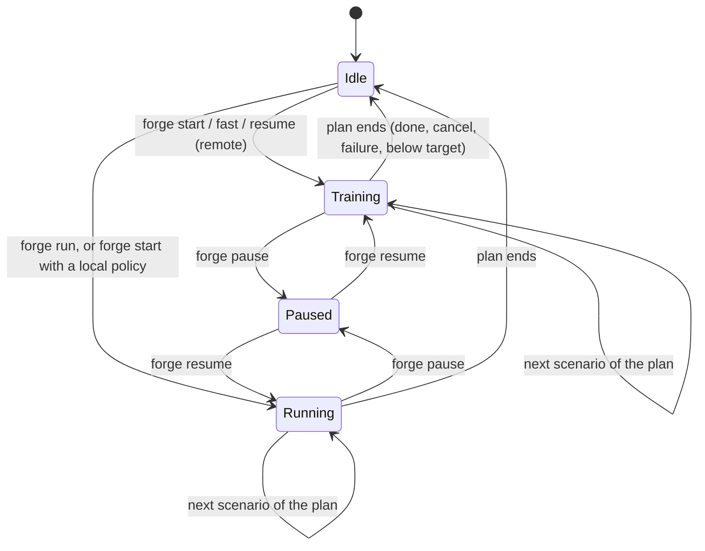

# 5. Animus Forge

Animus Forge (`mod-animus-forge`, repository `Moloch17/animus-forge`) runs training on the forge core. It has two
halves in one repository:

- **The module** (`src/`, C++, namespace `AnimusForge`) runs inside the worldserver. It owns the plan of scenarios to
  train, the console commands, the socket bridge, the learner and export child processes, and the progress reports.
  It builds scenarios and env pools with animus-lib.
- **The learner** (`python/`, package `animus`) is a separate process. It holds the MAPPO networks, rollouts and
  updates, seeded evaluation, convergence and stage targets, seeding from earlier stages, distillation and `.amdl`
  export.

Part A covers the module and part B the learner. Operational recipes are in [chapter 7](07-operations.md), and every
key and file format is in [chapter 8](08-reference.md).

---

## Part A: the module

## 5.1 Source map

| File | Role |
|---|---|
| `src/animus_forge_loader.cpp` | `Addmod_animus_forgeScripts`: registers animus-lib's scripts, then the forge's |
| `src/Hooks/AnimusForgeScripts.cpp` | Installs `CoreHooks` (sim sessions, sim groups, `rand_seed`), and the `WorldScript` forwarding `OnStartup`, `OnUpdate`, `OnShutdown` |
| `src/Hooks/ForgeCommandScript.cpp` | The `forge ...` console command table (administrator, console allowed) |
| `src/AnimusForge.{h,cpp}` | `Forge`: the state machine, plans, decisions, SPEC/STEP/MODE |
| `src/ForgeCommands.cpp` | The command implementations |
| `src/ForgeConfig.{h,cpp}` | Settings, path resolution, the fast profile, `StageSettings` |
| `src/Bridge/Protocol.h` | Wire protocol structs and constants (mirrored by `python/animus/protocol.py`) |
| `src/Bridge/LockstepServer.{h,cpp}` | Single-client Unix socket server |
| `src/Learner/ChildProcess.{h,cpp}` | Starting, reaping and stopping a helper process |
| `src/Learner/LearnerProcess.{h,cpp}` | The learner's command line |
| `src/Console/Progress.{h,cpp}` | `progress.json` reader, the status report and warnings |
| `src/Console/TextTable.{h,cpp}` | Console tables |
| `conf/mod_animus_forge.conf.dist` | Every key, documented |
| `mod-animus-forge.cmake` | Clones and requires animus-lib |

## 5.2 Startup

`OnStartup` loads `ForgeConfig`, derives the fast profile and returns early if `AnimusForge.Enable = 0`. With the
default `remote` policy it opens the socket immediately, so a learner started by hand can connect as soon as a plan
starts. It then logs that the sim is idle and prints the idle status. **Nothing trains until an operator types
`forge start`**, and the server never resumes a run on its own after a restart.

### Path resolution

Relative paths in path keys are resolved against **the directory of the `worldserver.conf` the server loaded**, not
its working directory: `Socket`, `OutputDir`, `ModelDir`, `Learner.WorkDir`, `Learner.Python`, `Learner.Config`,
`Learner.LogFile` and `Fast.Learner.Overlay`. The one exception is `Fast.OutputDir`, which nests inside the resolved
`OutputDir`.

| Key | Empty or default resolves to |
|---|---|
| `Learner.WorkDir` | `<module source>/python`, taken from `__FILE__` at compile time, so it works for native builds and the bind-mounted Docker services but not for baked images |
| `OutputDir` | The learner work directory (Docker sets `/azerothcore/var/animus-forge`) |
| `Learner.Python` | `<WorkDir>/.venv/bin/python` if it exists, else `python3` from `PATH` |
| `Learner.Config` | `configs/<scenario>.yaml` in the work directory |
| `Learner.LogFile` | `<LogsDir>/animus-learner.log` |
| `ModelDir` | `<module source>/models` |
| `Fast.OutputDir` | `<OutputDir>/fast`. It is forced back there if the configured value is or contains `OutputDir` |
| `Fast.Learner.Overlay` | `<WorkDir>/configs/fast.yaml` |

`AnimusForge.Envs` is capped at `BotAccounts::MAX_ENVS` (12500).

## 5.3 Plans and the state machine

A **plan** is a list of scenarios run one after another with one policy:

```cpp
struct Plan { std::vector<PlanEntry> Entries; uint32 Index; std::string Policy; uint64 LocalEpisodes; bool Fast; };
struct PlanEntry { std::string Scenario; bool Resume; Outcome Result; };
```

`Forge` is always in one of four states:



**Console commands only record requests.** A command sets `_request` (Start, Cancel, Skip), `_pauseRequested` or
`_resumeRequested` and replies at once. `OnUpdate` applies the request at the start of the next tick, never in the
middle of a decision.

**Starting a scenario** (`StartCurrent`):

1. `CreateScenario(name, config.Stage())`. This builds the layouts and writes `layouts/<stage>/`.
2. A local policy name is checked before anything else is built (`KnowsPolicy`).
3. `EnvPool::Setup()` builds every env: a new instance and bots per env.
4. Remote: `Listen` on the socket, then start the learner if `Learner.AutoStart` (a failed start is logged with the
   manual command, and the sim keeps waiting for a learner started by hand).
5. `ResetAll()`, reset the counters and rates, `ProgressMonitor::Begin`.
6. `PoolRegistry::Register`, so the hooks feed the pool from now on. State becomes Training or Running.

**Ending a scenario** (`FinishCurrent(outcome)`) prints the progress report, tears the scenario down (unregister,
disconnect, stop the learner unless it already finished by itself, `EnvPool::Teardown`), then starts the next entry or
ends the plan. The last plan is kept for `forge resume` without arguments.

| Outcome | Cause |
|---|---|
| `done` | The learner exited 0 (converged and passed its target, or passed at its step budget), or a local run reached its episode count |
| `skipped` | `forge skip` |
| `failed` | The scenario couldn't be built or started, or a local policy failed |
| `cancelled` | `forge cancel` (the learner saved `latest.pt` if it was running) |
| `below target` | The learner exited 3. **The plan halts here**, so later stages don't train on a stage that isn't good enough |

A learner that crashes (any other exit) doesn't end the plan. The sim keeps waiting on the socket, the status report
warns that the learner exited unexpectedly, and `forge resume` restarts it from its checkpoint.

## 5.4 One tick

`Forge::OnUpdate(diff)`:

1. If disabled, return.
2. Reap a finished export, then apply a pending request.
3. Turn a pending pause into `Paused` and **hold inside the tick** (`HoldWhilePaused`): loop every 50 ms, polling the
   learner and running console commands, until resume or a request. Nothing ticks while paused (maps, episode clocks,
   the learner), so an episode continues exactly where it stopped.
4. If idle, sleep 50 ms and return, so an idle sim doesn't spin a core.
5. If `diff` is not `DecisionMs / TicksPerDecision`, log an error once (the worldserver disagrees about the split).
6. `EnvPool::AdvanceClock(diff)` -- every tick, because game time accrues whether or not anyone decided.
7. If fewer than `TicksPerDecision` ticks have passed since the last decision, stop here. The world moved and the
   policy did not; this is what makes movement finer than a decision. At the default of 1 it never stops here.
8. Maybe print the periodic report, then `RemoteDecision()` or `LocalDecision()`.

The tick counter that reaches the report (`_ticks`, `EnvStepsPerSecond`, every ms-per-tick bucket) counts
**decisions**, not world updates, so the per-decision figures keep meaning what they say. A world running four ticks
to the decision shows four ticks' worth of world time against one decision, which is the honest reading.

**Local decision:** `Collect`; stop if the plan's local episode count is reached; `ChooseLocalActions(policy)`;
`ApplyActions`.

**Remote decision:**

```
if no learner connected:
    AcceptClient(onAccepting)          blocks; returns false on stop, cancel/skip/pause request,
                                       or when the auto-started learner has exited (0 → done, 3 → below target)
    SendSpec()
    SetEvaluation(false); ResetAll()   every new session starts from fresh training episodes
else:
    Collect()
SendStep()
loop:
    ReceiveAny(onIdle)                 blocks; console commands and reports keep running
    ACT  (E×A int32)   → copy into Actions, break
    MODE               → SetEvaluation(...), ResetAll(), SendStep(), continue
    CLOSE / bad input  → DropClient, return (the next decision waits for a new learner)
if evaluating with a baseline:
    ChooseLocalActions(baseline, opponentsOnly)   overwrite the learner's actions (all, or opponent seats)
ApplyActions()
```

While the world thread blocks in `AcceptClient` or `ReceiveAny`, the idle callback runs every poll interval (200 ms).
It polls the learner process, runs `Pump()` (console commands, export reaping, periodic report; guarded against
re-entry) and returns false when a request needs the scenario to stop. That is why the console answers within a
fraction of a second even while Python computes an update.

## 5.5 The socket server

`LockstepServer` is plain POSIX. The host is Linux-only, the exchange is blocking lock-step, and every wait must check
`World::IsStopped()` so SIGINT still ends the process while the world thread waits.

- `Listen(path)`: unlink any stale socket file, bind, listen with backlog 1. It does nothing if already listening on
  that path. `Shutdown` closes and unlinks.
- `AcceptClient`: poll the listener, accept, and require a valid `HELLO` with the right version.
- `Send(type, chunks)`: header plus the concatenated chunks. The pool's buffers are sent directly with no copying into
  a message struct.
- `ReceiveAny(type, payload, maxSize, onIdle)`: any message up to `maxSize`. `CLOSE` drops the client and returns true
  with an empty payload.
- One client at a time. A second learner can't connect while one is attached.

The protocol's byte layout is in [chapter 8](08-reference.md#83-wire-protocol-version-6).

## 5.6 The learner and export processes

`ChildProcess` runs a helper without blocking the world thread:

- `Start(args, workDir, logFile)`: `fork` and `exec`, `args[0]` looked up on `PATH`, stdout and stderr appended to
  the log.
- `Poll()`: reap without blocking and log how the process ended, once.
- `FinishedCleanly()` (exit 0), `ExitCode()`, `FailedUnexpectedly()` (exited otherwise and wasn't stopped on purpose).
- `ExpectExit()` marks a coming exit as intentional, so it is logged as stopped rather than failed.
- `Stop(grace)`: wait `grace` for a voluntary exit, then send SIGINT (Python saves on `KeyboardInterrupt`), wait
  `grace`, then SIGKILL. The worst case is 3 x `grace`.

**Stopping the learner.** Closing the socket is the signal to save and exit. On cancel or skip the sim drops the client
and waits up to 15 s per phase. On shutdown it waits 10 s.

`LearnerProcess` builds the command line:

```
<Python> -u -m animus.train --config <configs/<scenario>.yaml> --socket <Socket> --run-name <scenario>
         --runs-dir <OutputDir>/runs --layouts-dir <OutputDir>/layouts [--resume] <Learner.Args...>
```

It first checks that `<WorkDir>/animus/train.py` and the config exist. The run is always named after the scenario, so
even a shared `Learner.Config` gives every scenario its own run directory.

## 5.7 Console commands

Commands are typed without a leading dot on the worldserver console and need administrator security. They also work
from an in-game administrator's chat.

| Command | Behaviour |
|---|---|
| `forge help` | The command list |
| `forge status` | The progress report while something runs. When idle, the settings and the last plan's outcome. Also shows a running export and pending requests |
| `forge scenarios` | Every scenario with its run: finished and why, resumable checkpoint, steps, best score; exported model count |
| `forge start [scenario ...]` | Refused unless idle. Without names: `AnimusForge.Queue` (every default-queue stage when empty), leaving out stages whose `finished.json` says `"advanced": true` (`Queue.SkipFinished`). Named scenarios are never skipped. Warns about stages listed before their parents, or whose parents have no finished run. Every scenario trains from scratch, and the learner archives an earlier run to `runs/_archive/<scenario>-<time>/` |
| `forge fast [scenario ...]` | Like `start` with the fast profile (5.8). Without names: `Fast.Queue`, or every curriculum stage in order when it is empty, each trained again from scratch (nothing is skipped) |
| `forge resume [scenario ...]` | **Paused:** continue. **Waiting on a crashed learner:** restart it with `--resume`. **Idle, with names:** a new plan whose first entry resumes from `runs/<first>/latest.pt` and the rest train from scratch. **Idle, without names:** the last plan, from the entry where it stopped (resuming it). Refused if the policy isn't remote or there is no `latest.pt` |
| `forge pause` | Freeze after the current decision |
| `forge cancel` | End the plan. The learner saves `latest.pt` first |
| `forge skip` | End the current scenario (the learner saves) and start the next |
| `forge run <scenario> <policy> [episodes]` | A local plan: `random`, `greedy` or `fight`, for N episodes or until cancelled. `forge run <s> remote` is refused (use `start`) |
| `forge rays <map> <x> <y> <z> [facing]` | What the movement block's navmesh senses read standing there, with no seat, policy or run: reach and shore along each of the sixteen rays (the eight bearings and the rays half way between them), the burning edge, clearance and the way out, whether the point is inside a building, and the floor under it. Every one of those is a Detour query on `{y, z, x}` axes, where a wrong swizzle returns plausible numbers about the wrong place and nothing downstream can catch it — so the report measures one wall three independent ways and prints whether they agree. Also the way to vet a spawn point before a stage trains on it |
| `forge talents <class_role> [spec] [points] [plan]` | Print the talent build the curriculum would give that class (which talents, in which tree, at how many ranks). `points` defaults to a level 80 character's, `plan` is `standard`, `noisy` or `random` |
| `forge bench [scenario]` | Time the sim at every `AnimusForge.Bench.Threads` x `Envs` pair, then the fastest few with the learner; `forge bench apply` writes the winner into the configs |
| `forge export [scenario] [best\|latest]` | Background `python -m animus.export` of `best.pt` (else `latest.pt`) of the scenario (default: the current or last one) into `ModelDir`, with the layout manifests. Output in `animus-export.log`. One export at a time. Works while training |
| `forge clean archive \| scenario <s> \| exports \| fast \| logs \| all` | Delete `runs/_archive/`, one run, exported models and manifests, the fast output, the learner and export logs, or everything (idle only). Each refuses while it would delete something in use, and lists every removal with its size |
| `forge progress [seconds\|off]` | Show or set the periodic report interval |

## 5.8 The fast profile (`forge fast`)

A real stage trains for hours before it reaches a stage decision. `forge fast` runs the same pipeline on an easier
problem so a change can be checked in minutes. `ForgeConfig::FastProfile()` copies the settings and changes:

| Setting | Fast value |
|---|---|
| Policy | `remote` |
| Envs | `AnimusForge.Fast.Envs` (the conf template sets 32; the code default is 16) |
| Report episodes | min(ReportEpisodes, 64) |
| Output and models | `Fast.OutputDir` (runs, layouts, and `models/` inside it) |
| Learner args | `--overlay <Fast.Learner.Overlay>`, then `Learner.Args`, then `Fast.Learner.Args` |

**Level and classes are deliberately not narrowed.** A fast run plays the same content a real one does --
every class, the curriculum's own random levels -- and differs only in how long each stage gets and how many
envs run it. It used to train four classes at level 20, which made the sweep a rehearsal of a problem the real
build never trains: the classes it skipped were the ones whose faults a sweep exists to find. `AnimusForge.Fast.Level`
and `AnimusForge.Fast.ClassRoles` are left over from that and are **read by nothing** -- setting either changes
nothing (`ForgeConfig::FastProfile`).

Decision interval, episode lengths and rewards stay the real ones. `configs/fast.yaml` is merged over each stage's
config: a 10M-step fallback budget, evaluation of 64 episodes every 1M steps, a convergence window of 3
evaluations. The sim then overrides two of those per invocation: `total_env_steps` from `AnimusForge.Fast.Budget` (or `forge fast 30M`),
and `convergence.patience=0` -- which is what makes a budget a budget, since a stage then trains every step it was
given instead of stopping when its score flattens. The default `Fast.Queue` is empty: every curriculum stage in
order, the two raid stages included, so a plain `forge fast` is a full run of the curriculum with no stage
skipped.

A fast run never archives, seeds from or overwrites a real run, because everything lives under `fast/`. `pause`,
`cancel`, `skip`, `resume` and `export` without arguments act on the fast plan while it runs.

## 5.9 Progress reports

The learner rewrites `runs/<scenario>/progress.json` after every update and around every evaluation. It is one flat
JSON object, written to a temporary name and renamed, with non-finite values written as `null` and named in
`nonfinite`. `ProgressMonitor` combines it with the sim's own snapshot:

- **Header:** scenario, plan position, state, update, elapsed time.
- **Metrics table:** learner connection (pid, seconds since the last ACT), sim ticks per second, envs x agents,
  decisions, env steps against the budget, step rate and change, ETA to the step limit, the earliest convergence ETA
  (the evaluations still allowed without a new best, at the evaluation interval, and not before `min_env_steps` after
  the last restart), evaluation score (count, best, evaluations without improvement), best against the baseline,
  reward per decision, entropy, and more.
- **Plan table:** each entry's status, env steps, best score and ETA, with a plan ETA.
- **Warnings**, one line each, only when they apply:
  - the learner hasn't answered for 2 minutes
  - the step rate dropped more than 30% below the run's average
  - entropy is under 25% of its first value
  - approx KL is over 0.05 or the clip fraction over 30%
  - a metric is NaN or infinite
  - the best score is still below the baseline after 2 evaluations
  - the next evaluation can end the stage by convergence
  - the learner exited unexpectedly
- **Local runs** show episodes done, the ETA to the episode limit, and the episode info means over the last
  `ReportEpisodes` episodes.

The report prints on `forge status`, at every stage end, and every `Progress.Interval` seconds if that is set.

## 5.10 Export

`forge export` runs, in the background:

```
<Python> -u -m animus.export --checkpoint <run>/<best|latest>.pt --out <ModelDir> --layouts-dir <OutputDir>/layouts
```

Training never publishes models. Exporting is always an explicit request, and copying models to a realm is done by
hand. See 5.20 for what the export writes.

---

## Part B: the learner

## 5.11 Package map

| Module | Role |
|---|---|
| `animus/train.py` | `TrainingRun`: the whole run, from connecting to `finished.json` |
| `animus/config.py` | Dataclass config, YAML `extends`, overlays, `--set` |
| `animus/protocol.py` | Wire structs mirroring `Protocol.h` |
| `animus/env.py` | `ForgeEnv`: connect (retrying up to 600 s), HELLO/SPEC, `reset`, `step`, `set_mode`, `close` |
| `animus/mappo/networks.py` | `LayoutActor`, `LayoutCritic`, masked categorical |
| `animus/mappo/buffer.py` | `RolloutBuffer`, `compute_gae` |
| `animus/mappo/trainer.py` | `MappoTrainer`: act, value, update, checkpoints |
| `animus/mappo/valuenorm.py` | `ValueNorm` |
| `animus/stages.py` | `stage.json` helpers: seed chain, merges, block spans, arena names and state span, model names |
| `animus/bootstrap.py` | Seeding from the extended stage and merged stages |
| `animus/distill.py` | Teachers and the KL loss |
| `animus/evaluation.py` | Seeded evaluation, summaries, `ConvergenceTracker` |
| `animus/gates.py` | Stage target checks |
| `animus/stage.py` | `StageController`: continue, advance, restart or halt |
| `animus/runs.py` | Archiving, checkpoint pruning, resume checks |
| `animus/progress.py` | `progress.json` |
| `animus/export.py` | `.amdl` export |
| `animus/evaluate.py` | Standalone evaluation of a checkpoint |
| `tests/` | Protocol, config, GAE, masking, bootstrap, distillation, evaluation, gates, stage controller, runs, progress, export, a training-run test |

Python 3.11 or later with numpy, pyyaml and torch 2.4 or later. Extras: `tensorboard`, `dev` (pytest).

## 5.12 Configuration

`TrainConfig.load(path, overrides, overlays)`:

1. **`extends`.** Load the YAML and recursively merge it over the file named by `extends:` (relative to the
   extending file). Every curriculum config extends `stage8_duel.yaml`, directly or through a chain, and lists only what
   it changes.
2. **Overlays** (`--overlay`) are merged over the result in order.
3. **`--set key=value`** overrides are applied last. Dotted keys address sections, and values are parsed as YAML.
4. **Strict typing.** Unknown keys and wrongly typed values fail at load. For example, `total_env_steps: 3e8` is a
   string in YAML and is rejected before the run starts rather than hours later.

Merging is by section. A non-empty map merges key by key. Anything else, including an empty map, replaces. That is how
`metrics: {}` in `fast.yaml` clears a stage's metric gates.

Top-level keys:

- run: `run_name`, `runs_dir`, `layouts_dir`, `socket`, `seed`
- budget and logging: `total_env_steps` (decisions x envs x agents), `rollout_length`, `log_every`,
  `checkpoint_every`, `keep_checkpoints`
- devices: `train_device` (`auto` = CUDA/ROCm if torch sees a GPU), `rollout_device` (`cpu`), `torch_threads`
  (0 = torch's default; the sim sets it from `AnimusForge.Learner.TorchThreads`)
- seeding: `init_from` (`auto` = the stage's seed chain), `merge_from` (`auto` = the stage's merges)
- sections: `mappo`, `distill`, `eval`, `convergence`, `target`, `restarts`

The sim's command-line arguments override `socket`, `run_name`, `runs_dir` and `layouts_dir`.

## 5.13 A training run

`TrainingRun.__init__`:

1. Seed Python, numpy and torch.
2. Without `--resume`, archive whatever `runs/<run>/` holds to `runs/_archive/<run>-<time>/`. With `--resume`, find
   `latest.pt` (or exit) and delete a stale `finished.json`.
3. Write `config.yaml`. Connect to the socket and receive the `SPEC`. Write `spec.json`.
4. Load `<layouts_dir>/<scenario>/stage.json` (the sim writes it before accepting a learner) and copy it into the run.
5. Validate the target against the scenario's episode info columns and arenas. A gate on a missing metric, or a
   baseline gate without `eval.baseline`, fails here.
6. Build `MappoTrainer` with one `(obs_dim, num_actions)` pair per layout.
7. Resume (weights, optimizers, update and step counters, convergence tracker, controller) or seed (5.17). Build the
   distiller if configured (5.18).
8. Open `metrics.csv` (appended on resume, with fixed columns so metrics that appear only on some updates are never
   dropped), TensorBoard if installed, the evaluation logs and the progress writer. On resume, restore the cached
   baseline score.

`run()`: receive the first STEP (fresh envs, with no transition), evaluate before training if `eval.at_start` and
nothing has been evaluated yet, then `train()`, and always `finish()`.

`train()` repeats until `total_env_steps`:

1. `rollout()`: fill the buffer and update (5.14-5.16),
2. log the update (`metrics.csv`, TensorBoard, `progress.json`, a console line),
3. every `checkpoint_every` updates, save `checkpoint_<update>.pt` and `latest.pt`, and prune to `keep_checkpoints`,
4. every `eval.every_env_steps`: `evaluate()` and let the stage controller decide (5.19).

At the budget it runs a final evaluation if the last one is stale, then `controller.at_budget`.

`finish()` saves `latest.pt`, writes `finished.json` if the stage was decided, updates `progress.json` and closes the
socket (which sends CLOSE). The process exit code is 0 for advance and 3 for below target.

## 5.14 Rollouts and GAE

Each rollout step:

```python
values = trainer.value(step.state, step.obs, step.layout)          # V per agent, denormalised
actions, log_probs = trainer.act(step.obs, step.mask, step.layout) # sampled
buffer.add_decision(obs, state, mask, layout, actions, log_probs, values, present)
layout = step.layout                                               # the ended episodes' layouts
step = env.step(actions)                                           # next STEP
final_values[done] = trainer.value(step.final_state, step.final_obs, layout)[done]
buffer.add_outcome(step.reward, step.done, step.terminated, final_values)
```

Rollouts run on the CPU (`rollout_device`) using a copy of the networks that is synced after each update, because one
small forward pass per decision is faster there. The ended episode's value uses **the previous STEP's layouts**,
because the next STEP already carries the new episode's layouts.

`compute_gae` handles auto-reset and time limits correctly. For step `t`, the successor value is:

- `values[t+1]` (or the bootstrap value after the last step) if the episode continued,
- `final_values[t]`, the value of the ended episode's last state, if it was **truncated** (done, not terminated),
- 0 if it **terminated**.

The advantage recursion never crosses an episode boundary. Returns are advantages plus values.

`RolloutBuffer.flat()` drops rows where `present` is 0, which are empty party seats. They have only the no-op and earn
nothing, so as samples they would only dilute advantages, entropy and value targets. Per-agent samples repeat the env's
state.

`total_env_steps` counts `rollout_length x envs x agents` per update. At 64 envs, one agent and a rollout of 128, one
update is 8192 env steps.

## 5.15 Networks

One set of weights plays every agent of every layout (parameter sharing):

```
actor:   obs[:obs_dim(layout)] ─► norm[layout] ─► adapter[layout] (Linear → hidden[0]) ─► tanh
             ─► trunk (Linear + tanh per hidden layer after the first)
             ─► head[layout] (Linear → num_actions(layout)) ─► masked logits

critic:  state ─► state_norm ─► state_encoder (Linear → hidden[0]) ─┐
                                                                    +─► tanh ─► trunk ─► value head (Linear → 1)
         obs ─► norm[layout] ─► adapter[layout] (Linear → hidden[0]) ─┘
```

- **Adapters** read only their layout's features, and **heads** write only their layout's actions. Padded columns are
  never used. What is learned about moving, threat, healing or interrupts goes through the shared trunk. Each
  class keeps its exact observation and action spaces.
- **Masking.** Disallowed logits are set to -1e9. A row with nothing allowed falls back to action 0.
- **The critic sees "agent-specific global state".** The env's state encoding is added to the agent's own adapter
  output, so each agent's value accounts for the whole env and its own situation.
- Agents are identified by their features, never by seat index, so the same network plays any seat.
- **Initialisation** is orthogonal: gain sqrt(2) for adapters and trunk, 0.01 for actor heads (a near-uniform initial
  policy), 1.0 for the value head, zero biases.
- For a single layout this is exactly a plain MLP. Adapter, trunk and head of one layout form one MLP, which is what
  export writes.

- **Observation normalisation** (`mappo.normalise_observations`, on by default). Each layout's observations are
  centred and scaled per feature (`RunningNorm`) before its adapter, in both the actor and the critic, and the critic's
  state likewise. The features arrive on very different scales (a level, yards, fractions, gear ratings) and meet tanh
  first, which saturates on anything far from zero. The statistics come from the rollouts (updated at each update,
  before it learns), are buffers that travel in the checkpoint, and carry across seeding for the blocks a stage keeps.
  The map is affine with no clipping, so export folds it into the adapter and the exported model stays a plain MLP.

The curriculum uses `hidden: [256, 512, 512]`: 256-wide adapters (one per class) and two 512-wide shared trunk
layers, so the capacity sits where every class trains it. Every stage must keep the same sizes, or seeding can't
copy the trunk.

## 5.16 The PPO update

`MappoTrainer.update(buffer, auxiliary)`:

1. Flatten the valid samples onto the training device. Normalise advantages to zero mean and unit variance, per
   class with `per_layout_advantages` (a layout with fewer than `min_layout_rows` rows uses the rollout's
   statistics), because the classes share a trunk but not a return scale.
2. With value normalisation, update `ValueNorm` (debiased exponential moving mean and mean-square, beta
   `mappo.value_norm_beta`: 0.99 in the curriculum) with the returns, and normalise the returns and old values. With
   observation normalisation, fold the rollout's observations and states into the running statistics.
3. For `epochs` passes over a random permutation split into `minibatches`:
   - **Actor:** `ratio = exp(logp - old_logp)`,
     `policy_loss = -mean(min(ratio x A, clip(ratio, 1±clip) x A))`, minus `entropy_coef x entropy`, plus the
     auxiliary (distillation) loss if any. Adam step with gradient-norm clipping.
   - **Critic:** clipped value loss `mean(max((V - R)^2, (V_old + clip(V - V_old, ±value_clip) - R)^2))` x
     `value_coef`, with its own Adam and clipping.
   - Record policy loss, value loss, entropy, clip fraction and approx KL (`mean((ratio - 1) - log ratio)`).
   - With `target_kl`, stop after an epoch whose mean approx KL exceeds 1.5 x `target_kl` (`epochs_run` records it).
4. Record `explained_variance` of the rollout's returns by its values, and sync the rollout copies.

`entropy_coef` and the learning-rate scale are set by the stage controller before each rollout (5.19): the entropy
floor's boost, and the rates held at full until the overall score plateaus. `freeze_layouts(indices)` stops training
the adapters and heads of the classes that have converged; `layout_stats` carries each class's entropy and approx KL
from the last update. `reset_optimizers()` and `shrink_perturb(shrink, perturb)` remain for experiments.

## 5.17 Seeding a stage (`bootstrap.py`)

With `init_from: auto`, the candidates are `<runs_dir>/<stage>/best.pt` for each stage in `stage.json`'s `seed_chain`
(closest ancestor first). The first one that exists is used, and a missing `best.pt` falls back to the `latest.pt`
beside it. Each checkpoint carries its own `stage.json`. An older checkpoint without one has it loaded from its run
directory.

`seed_trainer(trainer, checkpoint, spec, stage)`:

- **Trunk** (actor and critic): copied. Hidden sizes must match.
- **Observation normaliser statistics** move with the adapter columns: feature by feature for the blocks both stages
  have, so a kept block keeps the scale its weights were trained on.
- **Layouts are matched by name** (the class). For each layout both runs have, block spans from both
  `stage.json` files are compared:
  - **Adapter weights** (actor and critic): zeroed, then each common block's input columns are copied from their old
    position to their new position. New blocks' columns stay zero, so the seeded policy initially ignores them. Dropped
    blocks' columns are discarded. Biases are copied.
  - **Actor head:** each common block's action rows and biases move the same way. New actions keep their small initial
    weights.
  - A common block must have the same feature and action counts in both runs, or seeding raises an error.
  - Without block spans (old runs), the old layout is seeded as a prefix.
- **Layouts the checkpoint lacks** keep their fresh adapter and head but still get the copied trunk.
- **Not copied:** the critic's state encoder, value head and value normaliser, because the later stage's global state
  and reward differ.

**Merge seeding** (`seed_merges`). With `merge_from: auto`, after the extended stage has seeded, each merged stage's
`best.pt`, in order, seeds the **blocks of each layout that neither the extended stage nor an earlier merge had**:
adapter columns and head rows only, never the trunk or adapter biases. Those weights were trained against a different
trunk, so they are a warm start that distillation then aligns.

## 5.18 Distillation (`distill.py`)

A merge stage mixes arenas that different parents already play well. Seeding copies the trunk from one parent only, so
at first the policy plays the other parents' arenas worse than they do. **Kickstarting** corrects that. On decisions
from an arena that has a teacher, the actor loss gains

```
coef(env_steps) x mean KL(teacher || policy)        coef = max(min_coef, coef0 x 0.5^(env_steps / half_life))
```

- **Teachers.** With `teachers: auto`, each arena of the stage goes to the first parent (the extended stage, then the
  merges, in order) whose own `stage.json` has an arena of that name. A map `{arena: checkpoint}` names them
  explicitly. A teacher is a frozen `LayoutActor` rebuilt from its checkpoint.
- **Mapping.** For each of the stage's layouts the teacher also has, the blocks both have with equal sizes give index
  lists: which stage observation columns go to which teacher columns (the rest are zero), and which stage actions match
  which teacher actions.
- **Which rows.** Each decision's arena comes from the critic state's arena one-hot (`stage.json`
  `state.arena_first` and `arena_count`). Rows whose arena has no teacher, or whose layout the teacher lacks, aren't
  distilled.
- **The KL** is computed over the actions both networks have that the stage's mask allows, each distribution
  renormalised over that set. Rows with no such action are skipped.
- Below a coefficient of 1e-4 the term isn't computed. `metrics.csv` logs `distill_coef`, `distill_kl` and
  `distill_rows`.

## 5.19 Evaluation, convergence and the cast

### Seeded evaluation (`evaluation.py`)

`run_evaluation(env, spec, act, episodes, seed, baseline, opponents, arenas)`:

1. `env.set_mode(True, seed, episodes, baseline, opponents_only)` sends MODE. Every env resets, and seeds
   `0..episodes-1` are handed out as envs reset (see [3.4](03-animus-lib.md#seeded-resets)).
2. Step with argmax actions (`eval.deterministic`) until every seeded episode has ended, collecting each ended
   episode's return, info and layout by its seed index. A safety cap of `(ceil(episodes / envs) + 2)` episode lengths
   in decisions stops an evaluation that can't finish, and logs how many episodes it got.
3. `env.set_mode(False)` returns to training, and the returned STEP becomes the current observation.

The **score** is the mean episode return over every present agent of every seeded episode. It is the scenario's own
reward, so it measures what training optimises and compares checkpoints within one scenario, not across scenarios.
Combat rolls stay random, so every score carries a standard error.

**Summaries** give the score, its standard error, and the `eval.report` episode-info means overall, per level band
(1-20, 21-40, 41-60, 61-80), per layout (class) and per arena. Rows with `opponent_seat` are left out when
`opponents` is set.

**Sampled actions** (`eval.sampled_every`): every that many evaluations, the learner also plays sampled actions on the
same seeds and logs them as policy `learner_sampled` beside the argmax evaluation, printing score, `clean_kill`,
`killed`, `died`, `timed_out` and `arrived` for both, and writing the differences into that row of `eval.jsonl` as
`argmax_gap` (sampled minus argmax, per field). Training samples; evaluation and exported models take the argmax, so
a wide gap means the gated policy is not the one that trained (lower `mappo.entropy_final_fraction` then -- the
movement stages run it at 0.3 for exactly this reason: stage1_move's sampled policy arrived 0.996 against the
argmax's 0.979).

**Masked actions** (`eval.mask_actions`): names of actions the evaluation may not take, resolved per layout through
each layout's `action_names` (the same name sits at a different index in every class's catalog). Training is not
masked; the evaluation is, so the number says what the policy arrives at without the actions it leaned on. The
setting is meant for one measurement -- scoring the checkpoints trained with `follow_route` and `face_objective`
without them, on the binary that still has them -- and a name no layout has is refused rather than ignored, so it
cannot be left set across a build that removed the action. `python -m animus.evaluate --mask-actions` is the same
mask by hand.

**The baseline** (`eval.baseline`, `fight` for the curriculum) is scored once per run on the same seeds. It is cached in
`eval_baseline.json` under a key of policy, seed, episodes, opponents, arenas and the stage tuning, and in
`eval_baseline_<seed>_<episodes>.json` for confirmation seeds. With `opponent_baseline`, the sim plays the opponent
seats of self-play episodes with the baseline policy (`MODE_FLAG_SCRIPTED_OPPONENTS`) during both the learner's
evaluation and the baseline's own, so the baseline plays against itself.

A new best score saves `best.pt`.

### Convergence (`ConvergenceTracker`)

- An evaluation is a **new best** only if it beats the best by the margin: the largest of `min_improvement x |best|`,
  `min_improvement_abs`, and `z x sqrt(stderr^2 + best_stderr^2)`. A lucky evaluation inside the noise doesn't count.
- The overall score has **plateaued** when `patience` evaluations in a row set no new best, **and** a linear fit
  over the last `window` (at least 3) scores, projected `patience` evaluations ahead, wouldn't reach the margin (so a
  slow climb hidden by noise keeps training). The plateau is when the learning rates start to anneal
  (`lr_hold_until_plateau`); it does not end the stage by itself.
- `patience: 0` (a fast run) never plateaus: the rates stay at full and the stage trains to `total_env_steps`.

### The convergence rule (`stage.py`)

There are no stage targets, floors or restarts: every stage ends on the same signals, read **per class** over the
last `convergence.window` evaluations. A class has converged when all four hold:

1. **Score plateau** -- its own evaluation score has stopped improving by the margin above (a `ConvergenceTracker`
   per class, with the window as its patience).
2. **Policy stopped moving** -- its `approx_kl` per update, divided by the learning-rate scale in force, has stayed
   under `convergence.kl` (0.003). The division is the point: a KL that fell with the anneal is the schedule, not
   convergence, which is what the party run's 0.021-to-0.003 over 120M steps was, with its entropy flat throughout.
3. **Entropy settled** -- its entropy over `ln(allowed actions)` has a slope within `convergence.entropy_slope`
   (0.01) per evaluation and sits above `entropy_floor.fraction` when one is set: not still exploring, not collapsed.
4. **The ladder settled** -- on a ladder stage its training rung (the mean `difficulty` of its training episodes)
   has not moved by half a rung; on a league stage the live policy's win rate against the hardest league member has
   moved by less than 0.05.

`layouts.csv` carries each class's `entropy`, `approx_kl`, `allowed_actions`, `lr_scale` and `frozen` per update,
and `progress.json` says which classes have converged and what the weakest one is still missing.

**A converged class leaves the training draw.** Its layout weight drops to `convergence.hold_share` (0.02) and its
adapter and head are frozen (`MappoTrainer.freeze_layouts`; its rows are no longer samples), so the rest of the budget
goes to the classes still learning; only the shared trunk, which those classes keep training, can still move it. It
is still evaluated every evaluation, and if its score falls below its converged level by more than the margin it
**re-enters** at full weight and must converge again (`reentries` in the reports). With every class the run plays
converged the stage advances; a class the run never plays (a director in an undirected stage) is not waited for.

`total_env_steps` is a ceiling: a stage that reaches it advances too, with reason `budget`, and `finished.json` names
each class, whether it converged, and which signals it was missing.

### Keeping the update honest (`mappo`)

- `value_norm_beta`: how fast the value normaliser follows the returns (0.99 halves its old statistics every
  ~69 updates). The returns drift upwards as the policy improves; statistics that average the whole run leave the
  critic fitting a scale it has outgrown, and `value_loss` -- reported in normalised space -- shrinks either way.
  `explained_variance` in `metrics.csv` is the honest read.
- `per_layout_advantages` and `min_layout_rows`: centre and scale each class's advantages on its own rows,
  falling back to the rollout's statistics for a layout with fewer rows than the minimum. The classes share a
  trunk but not a return scale, so one global scale lets the widest-spread of them set the shared gradient.
- `target_kl`: stop an update once its epochs have moved the policy about this far in KL (0 = never). PPO's
  clipping bounds a single step, not the sum of four epochs over one rollout. `epochs_run` records when it fired.
- `lr_final_fraction` and `entropy_final_fraction`: where `actor_lr`/`critic_lr` and `entropy_coef` end, as a fraction
  of their configured values, falling linearly over `total_env_steps` (1 = constant). stage8_duel ends its learning
  rates at a tenth: at a constant rate the update kept growing all run while the late gains were small.
- `recurrent_size`: a GRU between the actor's trunk and its action head (0 = off), carried from decision to decision
  and cleared when an episode ends -- the policy's own memory, for what no observation of the moment holds (which add
  was crowd-controlled, that the opponent has spent its trinket, what it was doing before the pull). The update then
  replays each rollout in order, minibatching envs rather than rows, from the memory each decision was taken with, so
  what the GRU stores is learned and not only what it reads. Evaluations, exported models and companions carry the
  same memory (`MlpPolicy::State`). It changes the actor's shape and the exported format, so turning it on retrains
  the curriculum from stage 1 and rebuilds every model. Distillation replays a teacher's own memory through the same
  decisions (`animus.distill`), so stage 8 works with it; a plain per-minibatch auxiliary loss is refused, because it
  cannot carry that memory. **On from stage8_duel (128).**
- `slow_layout`, `slow_every_decisions`, `slow_gamma`, `slow_gae_lambda`: a layout that decides on a slower
  clock than the seats and is credited on it -- the director (`""` = none, and a stage without a layout of
  that name simply has no agents of it). Its agents choose every `slow_every_decisions` and their call stands
  in between, as the goal head keeps a goal. A held decision is replayed by the recurrence, because the env
  moved on, but it is **not a sample**: the agent chose nothing there, so it never reaches the loss or the
  advantages. Its transitions run from one decision it took to the next, carrying every reward in between, so
  `slow_gamma` and `slow_gae_lambda` are per *its* decision -- at ten decisions a call and 250 ms a decision,
  0.996 is a ten minute horizon against the seats' hundred seconds. Rewards inside one span are summed rather
  than discounted: a span is seconds and the horizon is minutes.
- `goal_count` and `goal_every_decisions`: a goal head (0 = off). The actor chooses one of `goal_count` goals every
  `goal_every_decisions` decisions and keeps it in between, and its action head reads the goal's embedding added to
  the features. The chooser decides on a clock that many times slower than the actions, so its own horizon is that
  many times shorter -- which is where a plan longer than a fight's next second can be learned. The goal is part of
  the decision: its log probability joins the action's in the PPO ratio, and its entropy is kept up, on the decisions
  that chose one, and the critic reads the goal too, so the advantage a decision earns is measured against what that
  goal is worth rather than averaged over goals. Exported models choose the argmax goal on the same clock. The goals
  go to the sim with the actions (protocol 8), which scores whether each decision matched the goal, pays
  `Goals.Match` once per goal held (on the first decision that matches it, so a goal pays for being reached rather
  than for being sat in), reports `goal_<name>_share`, `goal_match_share` and `goal_changes`, and shows a
  party its teammates' goals. Per update the learner logs `goal_<i>_share` and `goal_kept_share`, which is how a
  collapsed head (one share at 1) is spotted. **On from stage8_duel (6 goals, chosen every 16 decisions).**
- `foresight_coef`, `foresight_horizons_seconds` and `foresight_time_scale_seconds`: an auxiliary head on the actor's
  trunk (0 = off, the default). It predicts, from the very features the actions are chosen from, the discounted return
  at each horizon and how much of the episode is left as a share of the time scale; its loss (Huber on the returns,
  squared error on the share) times `foresight_coef` is added to the actor's. A policy whose features cannot say
  whether a fight is nearly over, or what the next ten seconds are worth, cannot plan around either; predicting them
  is what makes the features carry it. The targets come from the rollout (`mappo.buffer.compute_foresight`): the
  discounted return to the end of the episode, bootstrapped by the head itself where the rollout or a time limit cut
  it off, and the decisions left where the episode ends inside the rollout (the rest are left out of the loss).
  `foresight_loss` is logged per update. Nothing reads the head while acting, and exported models leave it out, so it
  costs a little training time and nothing in game.

### Keeping exploration alive (`entropy_floor`)

A masked policy's entropy ceiling is `ln(legal actions)`, which swings with level, cooldowns and the global
cooldown and is nothing like `ln(padded action count)` -- so a flat `mappo.entropy_coef` says little about
whether the policy still explores. With `fraction` set, the coefficient climbs (to at most `max_boost` times the
configured one, at `rate` per update) while entropy sits below that share of the ceiling, and falls straight
back once it recovers. It is a floor, never a ceiling: a policy converging on its own is never held open. Read
`entropy` against `allowed_actions` in `metrics.csv`; `entropy` is the action head's alone, and a goal head's is
`goal_entropy` beside it, so neither hides the other.

### Where the episodes go (`layout_sampling`)

Training episodes draw a class and build evenly, but a stage is gated on its weakest one. With `layout_sampling.enabled`
the learner sends the sim a weight per class and build after every evaluation (protocol `WEIGHTS`), from the gap between
that class and build's score and its baseline's, measured in standard deviations of the gaps so the weights do not depend
on the size of the scenario's rewards. `strength` scales the effect (0 = even), `max_ratio` caps the spread between
the heaviest and the lightest, and the weights average 1, so the number of episodes is unchanged -- only where they
are spent. Evaluation episodes stay evenly spread over the class and build pairs whatever the weights are.

The score gap alone misses a class and build that beats its baseline yet fails an absolute gate (stage8_duel's mage beat
the scripted mage while killing only 68% of the time). `metric` names a summary field where higher is better, usually
the one the stage is gated on (`clean_kill`): a class and build's need is then the larger of its score gap and its
shortfall on the metric, each in its own standard deviations, so a wide lead over a weak baseline cannot cancel a
gate it is failing.

`replay_fraction` replays lost fights. After every training evaluation the learner sends the sim the seed indexes of
the episodes that fell short on `metric` (a per-episode 0/1 field such as `clean_kill`; protocol `REPLAY`), and that
share of training resets rebuilds one of them from the same random numbers the evaluation used: the same character
meets the same opponent, and the fight rolls afresh. A replay reports as an ordinary training episode. Confirmation
seeds are never sent, so the gate that moves a stage on stays held out, and a new learner session starts with no
replay seeds.

### The stage controller (`stage.py`)

After each evaluation (`after_eval`) and at the budget (`at_budget`) the `ConvergenceController` returns an action:

| Situation | Action | Learner |
|---|---|---|
| Some class the run plays has not converged, budget left | continue | Keep training; converged classes are held and frozen |
| Every class the run plays has converged | **advance** | Exit 0, `finished.json` reason `converged` |
| Budget reached | advance | Exit 0, reason `budget`; the report names who was not done |

Nothing halts the plan but a crash. The advance is appended to `stage.jsonl` with every class's signals, and
`finished.json` records the reason, the step and update counts, the best score and where it was reached, and per
class whether it converged, how many times it re-entered, and which signals it was missing.

### The cast: frozen checkpoints in the seats a script used to play (`cast.py`)

The far side of a self-play arena -- seat 1 of a `Mirror` arena, the second team of a `Teams` one -- is played in
training by a **frozen checkpoint** rather than by the live policy alone, and any agent the sim declares in
stage.json's `cast` list (an owner played for the seats) likewise. Their rows take the frozen actor's action and
are not samples. Nothing changes on the wire: the learner tells an opponent seat from stage.json (each arena's
`plan` and `team_seats`, the episode's arena from the critic state one-hot) and a declared agent from the `cast`
list; a frozen actor is `distill.build_teacher`'s, mapped block by block onto the stage, with its own memory and
goals per row.

```yaml
cast:
  opponents: league        # "" live self-play | auto = the seed chain's parent best.pt | league = parent + this run's snapshots | a path
  parent: "{runs_dir}/stage12_pvp/best.pt"   # the league's first member when the seed parent is a PvE policy
  opponent_share: 0.5      # share of self-play episodes whose far side is cast, drawn per env at episode start
  agents: {owner: "{runs_dir}/stage11_endurance/best.pt"}   # stage.json `cast` entries by name
  snapshot_every_env_steps: 5000000
  league_size: 8
  rate_window: 200
  floor: 0.05
  retire_above: 0.85
  keep_newest: 2
```

**The league is fed on a clock, not on `best.pt` alone.** `best.pt` moves only behind the convergence margin, so a
league fed from it can go a whole stage without a new member. Every `snapshot_every_env_steps` the current
`latest.pt` is copied into `<run_dir>/league/step_<env steps>.pt`, and every improved `best.pt` into
`best_<env steps>.pt`. Members are drawn per episode by prioritised fictitious self-play weights,
`(1 - p)^2 + floor` with `p` the live policy's win rate against the member (an average over `rate_window` of the
live seats' `won` at the episode's end), so the ones the policy still loses to are met most and none is forgotten.
A member beaten above `retire_above` for a full window is retired; the newest `keep_newest` never are, and
`league_size` prunes the most-beaten first, never the newest or the hardest. `league.json` in the run directory
lists them, and `metrics.csv` carries `cast_rows` (the share of rows cast), `cast_fallback_rows` (rows whose layout
the checkpoint lacked), `cast_members` and `cast_hardest_win_rate` -- the live policy's win rate against its
hardest member, which climbing toward 1 says the pool has gone stale and the clock is too slow. The convergence
rule reads it too: on a league stage a class's ladder signal is that this rate has settled.

**The evaluation never runs a cast actor.** The sim's `fight` baseline plays the far side of a seeded evaluation
(`eval.opponent_baseline`), so the yardstick is fixed across runs; the league is a training-time device.

**The owner as a cast seat** (`ArenaDefinition::OwnerCast`, the companion, party, tanking, triage and crossroads
arenas): the sim builds the owner as a seat in an agent slot of its own after the seats and the directors, declares
it in stage.json's `cast` list, observes it and applies its action like any seat, pays it nothing and leaves its
episode-info row empty; the learner plays the row from `cast.agents.owner`. `Owner.CastScriptedShare` (30%) of the
training episodes keep the scripted owner, which wanders and engages on a timer, and every evaluation does, so the
reported `owner_deaths` are measured beside the owner they always were.

**Kept scripted, on purpose:** the hunter of the evade, hide and stealth drills (`ScriptedPlayer::Search` is what
those drills measure against), the scripted director (a yardstick), the ambushers (they arrive mid-episode, which
the per-episode `present` contract cannot carry), and `fight` as the evaluation opponent.

## 5.20 Checkpoints, resume and export

A checkpoint (`.pt`, written as `.partial` and renamed) holds the trainer state (actor, critic, value norm, both
optimizers), the config, the spec, the update and env step counts, the convergence tracker and controller state, and
the stage (`stage.json`), which later stages need for block positions.

**Resume** (`--resume`) continues `latest.pt` in place. It refuses if the scenario name, agents per env, obs dim, state
dim, action count or layouts changed. The env count, decision interval and episode length may change.

**Export** (`export.py`) writes, for each layout of the checkpoint:

- `<model name>.amdl`: the layout's adapter (with its observation normaliser folded in: `W / sd` and
  `b - W(mean / sd)`), the trunk layers and the layout's head, in the format described in
  [3.8](03-animus-lib.md#38-models), with `num_agents = 1` and a zero-weight agent column. The model name comes from
  `stage.json` `models` (`warrior_dps` at `stage8_duel` is `warrior_dps_duel`). A scenario without `stage.json` uses
  its own name for a single layout, or appends the layout name.
- `<model name>.json`: the layout manifest, copied from `<layouts_dir>/<stage>/`.

`tests/test_export.py` checks that an exported network reproduces the torch actor's greedy actions.

`python -m animus.evaluate --checkpoint <pt> --episodes N --seed S --baseline fight [--opponent-baseline]
[--mask-actions NAME ...]` scores a checkpoint by hand against a running sim. `--mask-actions` forbids actions by
name while scoring, resolved per layout as `eval.mask_actions` is: what a checkpoint arrives at without the actions
it leaned on. A name no layout of the checkpoint's stage has is refused, so a mask written for one build cannot
silently forbid nothing on another.
